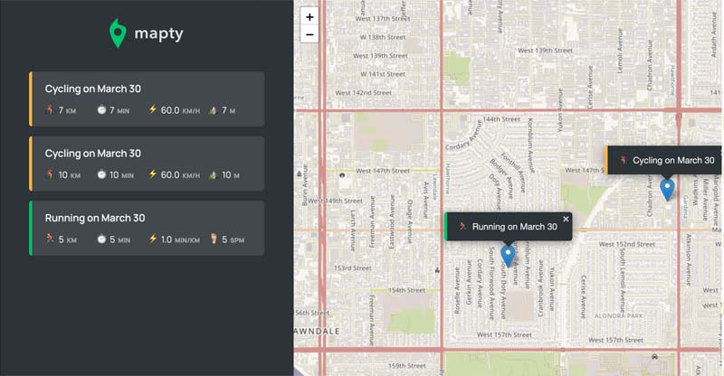

# js-mapty
Mapty uses the Geolocation API to collect latitude and longitude coordinates of the user. Then, the user can click on the map, fill out a form to create either a cycling object or running object and a marker with that data will be added at the location that was clicked. The user can also click the data objects logged in the sidebar to allow the map to center on the desired workout marker.

## How Its Done
This project uses JavaScript OOP principals using ES6 classes. It uses parent and child classes and creates objects based on those classes. An object is created for the entire applicaton class using the new keyword to call it. This triggers the App class constructor function to fire. All initial logic is handled in that constructor and event listeners are also placed in that constructor. 

The project is organized with many private fields and methods. We also remember to bind callbacks with the this keyword when necessary to have access to the App class and all it's members inside the callback function.

It uses all the principles of OOP to create a clean organized code architecture. Also I used the project planning approach to layout user stories, features, language agnostic flowchart, and tech architecture plan.

